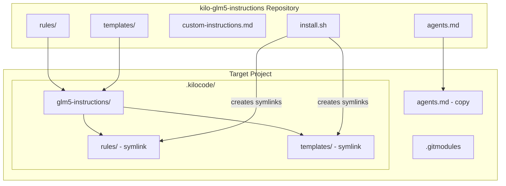

# Design Document: Kilo VS Code Extension Submodule Compatibility

## Executive Summary

This document outlines the design for restructuring the `kilo-glm5-instructions` repository to work seamlessly as a git submodule while being automatically detected by the Kilo VS Code extension.

---

## 1. Current State Analysis

### 1.1 Existing Repository Structure

```
kilo-glm5-instructions/
├── README.md
├── LICENSE
├── custom-instructions.md
├── agents.md
├── rules/
│   ├── main.md
│   ├── security.md
│   ├── accessibility.md
│   ├── backend.md
│   ├── frontend.md
│   ├── devops.md
│   ├── scripting.md
│   └── code-mode.md
└── templates/
    └── project-state.md
```

### 1.2 Kilo Extension Discovery Paths

Based on the README documentation, the Kilo VS Code extension discovers files in the following locations:

| Priority | Location | Purpose |
|----------|----------|---------|
| 1 | `~/.kilocode/rules/` | Global rules - user-wide defaults |
| 2 | `.kilocode/rules/` | Project rules - repository-specific |
| 3 | `.kilocode/rules-{mode}/` | Mode-specific rules |

### 1.3 Key Files and Their Roles

| File | Purpose | Loading Mechanism |
|------|---------|-------------------|
| `rules/*.md` | Domain-specific coding rules | Auto-loaded from `.kilocode/rules/` |
| `custom-instructions.md` | IDE-wide custom instructions | Manual paste into Kilo settings |
| `agents.md` | Project-level agent config | Placed in project root |
| `templates/project-state.md` | State tracking template | Copied to `.kilocode/project-state.md` |

---

## 2. Problem Statement

### 2.1 Current Limitations

1. **Manual Copy Required**: Users must manually copy `rules/` to `.kilocode/rules/`
2. **No Submodule Support**: Current structure doesn't align with expected `.kilocode/` paths
3. **Scattered Configuration**: Multiple files need different placement strategies
4. **Update Complexity**: Updates require re-copying files manually

### 2.2 Desired Outcome

- Add repository as git submodule → automatic detection
- Single command to update instructions across all projects
- Maintain logical organization of rules and templates

---

## 3. Proposed Solution

### 3.1 Option A: Direct `.kilocode` Structure (Recommended)

Restructure the repository to mirror the expected `.kilocode/` directory:

```
kilo-glm5-instructions/
├── README.md
├── LICENSE
├── .kilocode/
│   ├── rules/
│   │   ├── main.md
│   │   ├── security.md
│   │   ├── accessibility.md
│   │   ├── backend.md
│   │   ├── frontend.md
│   │   ├── devops.md
│   │   ├── scripting.md
│   │   └── code-mode.md
│   └── templates/
│       └── project-state.md
├── custom-instructions.md          # For manual IDE-wide setup
└── agents.md                       # For manual project root placement
```

**Submodule Usage:**

```bash
# Add as submodule directly to .kilocode
git submodule add git@github.com:Adrixan/kilo-glm5-instructions.git .kilocode

# Or add to a subdirectory
git submodule add git@github.com:Adrixan/kilo-glm5-instructions.git .kilocode/instructions
```

**Pros:**

- Direct alignment with extension expectations
- Minimal configuration needed
- Rules auto-detected when placed at `.kilocode/rules/`

**Cons:**

- Cannot have other `.kilocode/` content in the same directory
- Submodule replaces entire `.kilocode/` directory

### 3.2 Option B: Nested Instructions Directory

Create a dedicated instructions directory that can be referenced:

```
kilo-glm5-instructions/
├── README.md
├── LICENSE
├── instructions/
│   ├── rules/
│   │   ├── main.md
│   │   ├── security.md
│   │   └── ... (other rules)
│   └── templates/
│       └── project-state.md
├── custom-instructions.md
└── agents.md
```

**Submodule Usage:**

```bash
# Add as submodule
git submodule add git@github.com:Adrixan/kilo-glm5-instructions.git .kilocode/instructions

# Create symlink for rules (one-time setup)
ln -s .kilocode/instructions/rules .kilocode/rules
```

**Pros:**

- Allows other `.kilocode/` content alongside
- Clear separation of concerns
- Flexible placement

**Cons:**

- Requires symlink creation
- Symlinks may not work on all platforms (Windows)

### 3.3 Option C: Configuration-Based Discovery (Future-Proof)

Include a configuration file that the extension could use for discovery:

```
kilo-glm5-instructions/
├── README.md
├── LICENSE
├── kilo.config.json                 # Configuration manifest
├── rules/
│   └── ... (all rules)
├── templates/
│   └── project-state.md
├── custom-instructions.md
└── agents.md
```

**Configuration File (`kilo.config.json`):**

```json
{
  "version": "1.0",
  "name": "glm5-instructions",
  "description": "GLM-5 optimized instructions for Kilo Code",
  "rules": {
    "path": "rules",
    "files": [
      "main.md",
      "security.md",
      "accessibility.md",
      "backend.md",
      "frontend.md",
      "devops.md",
      "scripting.md",
      "code-mode.md"
    ]
  },
  "templates": {
    "path": "templates"
  },
  "customInstructions": "custom-instructions.md",
  "agentsConfig": "agents.md"
}
```

**Pros:**

- Most flexible approach
- Self-documenting structure
- Could support future extension features
- No restructuring required

**Cons:**

- Requires extension support for config file
- Not currently supported by Kilo extension

---

## 4. Recommended Approach

### 4.1 Hybrid Solution (Options A + B)

Implement a structure that supports both direct placement and nested usage:

```
kilo-glm5-instructions/
├── README.md
├── LICENSE
├── rules/                           # Primary location
│   ├── main.md
│   ├── security.md
│   ├── accessibility.md
│   ├── backend.md
│   ├── frontend.md
│   ├── devops.md
│   ├── scripting.md
│   └── code-mode.md
├── templates/
│   └── project-state.md
├── custom-instructions.md
├── agents.md
└── install.sh                       # Installation helper script
```

### 4.2 Installation Methods

#### Method 1: Submodule at `.kilocode/rules` (Recommended)

```bash
# Remove existing rules directory if present
rm -rf .kilocode/rules

# Add submodule
git submodule add git@github.com:Adrixan/kilo-glm5-instructions.git .kilocode/glm5-instructions

# Create symlink
ln -s glm5-instructions/rules .kilocode/rules
ln -s glm5-instructions/templates .kilocode/templates
```

#### Method 2: Submodule with Install Script

```bash
# Add submodule anywhere
git submodule add git@github.com:Adrixan/kilo-glm5-instructions.git .submodules/glm5-instructions

# Run install script
./.submodules/glm5-instructions/install.sh
```

### 4.3 Install Script Design

```bash
#!/bin/bash
# install.sh - Installation helper for kilo-glm5-instructions

set -e

SCRIPT_DIR="$(cd "$(dirname "${BASH_SOURCE[0]}")" && pwd)"
PROJECT_ROOT="$(git rev-parse --show-toplevel 2>/dev/null || echo ".")"
KILOCODE_DIR="$PROJECT_ROOT/.kilocode"

echo "Installing GLM-5 Instructions for Kilo Code..."

# Create .kilocode directory if needed
mkdir -p "$KILOCODE_DIR"

# Create symlinks
ln -sf "$SCRIPT_DIR/rules" "$KILOCODE_DIR/rules"
ln -sf "$SCRIPT_DIR/templates" "$KILOCODE_DIR/templates"

# Copy agents.md to project root (not symlinked - user should customize)
if [ ! -f "$PROJECT_ROOT/agents.md" ]; then
    cp "$SCRIPT_DIR/agents.md" "$PROJECT_ROOT/agents.md"
    echo "Created agents.md in project root"
fi

echo "Installation complete!"
echo "Rules: $KILOCODE_DIR/rules/"
echo "Templates: $KILOCODE_DIR/templates/"
```

---

## 5. File Structure Comparison

### 5.1 Before (Current)

```
kilo-glm5-instructions/
├── README.md
├── LICENSE
├── custom-instructions.md
├── agents.md
├── rules/
│   └── *.md
└── templates/
    └── project-state.md
```

### 5.2 After (Proposed)

```
kilo-glm5-instructions/
├── README.md                        # Updated documentation
├── LICENSE
├── CHANGELOG.md                     # NEW: Track version changes
├── rules/                           # Unchanged
│   ├── main.md
│   ├── security.md
│   ├── accessibility.md
│   ├── backend.md
│   ├── frontend.md
│   ├── devops.md
│   ├── scripting.md
│   └── code-mode.md
├── templates/                       # Unchanged
│   └── project-state.md
├── custom-instructions.md           # Unchanged
├── agents.md                        # Unchanged
├── install.sh                       # NEW: Installation helper
└── .github/
    └── workflows/
        └── test-install.yml         # NEW: Test installation script
```

---

## 6. Implementation Plan

### Phase 1: Repository Preparation

- [ ] Create `install.sh` script
- [ ] Create `CHANGELOG.md` for version tracking
- [ ] Update `README.md` with submodule instructions
- [ ] Add GitHub Actions workflow to test installation

### Phase 2: Documentation Updates

- [ ] Document all installation methods
- [ ] Add troubleshooting section
- [ ] Include Windows-specific instructions
- [ ] Add version update instructions

### Phase 3: Testing

- [ ] Test on Linux
- [ ] Test on macOS
- [ ] Test on Windows (Git Bash, WSL)
- [ ] Verify Kilo extension detection

---

## 7. Usage Examples

### 7.1 New Project Setup

```bash
# Create new project
mkdir my-project && cd my-project
git init

# Add GLM-5 instructions as submodule
git submodule add git@github.com:Adrixan/kilo-glm5-instructions.git .kilocode/glm5-instructions

# Create symlinks
ln -s glm5-instructions/rules rules
ln -s glm5-instructions/templates templates

# Copy agents.md for customization
cp .kilocode/glm5-instructions/agents.md .
```

### 7.2 Updating Instructions

```bash
# Update submodule to latest version
git submodule update --remote .kilocode/glm5-instructions

# Or update to specific version
cd .kilocode/glm5-instructions
git checkout v1.2.0
cd ../..
git add .kilocode/glm5-instructions
```

### 7.3 Existing Project Integration

```bash
# In existing project with .kilocode directory
cd my-existing-project

# Backup existing rules
mv .kilocode/rules .kilocode/rules.backup

# Add submodule
git submodule add git@github.com:Adrixan/kilo-glm5-instructions.git .kilocode/glm5-instructions

# Create symlinks
ln -s glm5-instructions/rules .kilocode/rules
```

---

## 8. Architecture Diagram



---

## 9. Alternative: Git Subtree Approach

For users who prefer not to use submodules, git subtree is an alternative:

```bash
# Add as subtree
git subtree add --prefix=.kilocode/glm5-instructions git@github.com:Adrixan/kilo-glm5-instructions.git main

# Update subtree
git subtree pull --prefix=.kilocode/glm5-instructions git@github.com:Adrixan/kilo-glm5-instructions.git main
```

**Pros:**

- No `.gitmodules` file needed
- Content is part of the repository
- Simpler for users unfamiliar with submodules

**Cons:**

- More complex update process
- Larger repository size
- Merge conflicts possible on updates

---

## 10. Summary

### Recommended Changes

| Change | Rationale |
|--------|-----------|
| Add `install.sh` | Automates symlink creation |
| Add `CHANGELOG.md` | Track versions for submodule updates |
| Update `README.md` | Document submodule usage |
| Keep existing structure | Backward compatibility |

### Key Decisions

1. **Keep existing file structure** - Maintains backward compatibility with manual copy approach
2. **Use symlinks for integration** - Allows submodule to live anywhere while being detected by extension
3. **Provide install script** - Simplifies setup across platforms
4. **Document multiple approaches** - Users can choose based on their needs

### Next Steps

1. Review and approve this design
2. Switch to Code mode to implement changes
3. Test with actual Kilo VS Code extension
4. Document real-world usage feedback
